# EDA de séries temporais — tempo, frequência e identificação de sistemas

Fonte: `data/processed/mimo_data.parquet` (série completa, 2.216 amostras horárias,
`2014-07-27 01:00 → 2014-10-27 09:00`), com os 8 `NaN`/coluna imputados por
interpolação. Notebook: `notebooks/eda/03_eda_series_temporais.ipynb`. Figuras:
`reports/figures/eda_series_temporais/`. Complementa
`1_analise-dados-reservatorio.md` (qualidade dos dados) com propriedades de série
temporal: distribuição, tendência, estacionariedade, autocorrelação, causalidade,
cointegração, similaridade/clustering, domínio da frequência e identificação de
sistemas.

Legenda das 7 variáveis usada em todo o documento:

- Entradas (`INPUT_COLS`): `freq_b1`, `freq_b2`, `freq_b3` (frequência das 3 bombas,
  Hz), `vazao_entrada` (vazão de entrada, l/s).
- Saídas (`OUTPUT_COLS`): `vazao_distribuicao` (l/s), `nivel_res` (nível do
  reservatório, m), `pressao` (mca).

## 1. Distribuições e correlação

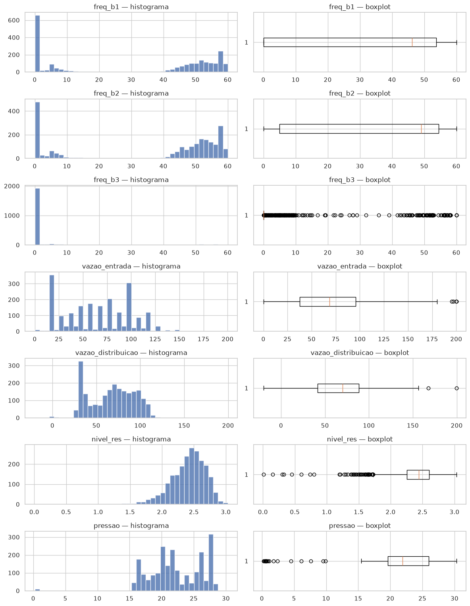

Os histogramas confirmam o padrão já visto em `1_analise-dados-reservatorio.md`:
`freq_b3` é quase sempre zero (bomba 3 praticamente inativa), `freq_b1`/`freq_b2`
têm distribuição bimodal (liga/desliga), e as 3 saídas têm distribuição
aproximadamente unimodal, com caudas longas nos boxplots correspondendo às amostras
marcadas como falha de sensor (nível ~0, pressão < 5 mca).

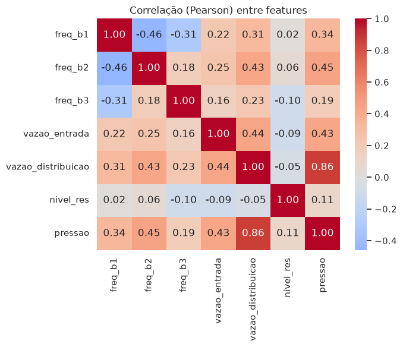

A correlação linear mais forte do dataset é `vazao_distribuicao`/`pressao` (0.86) —
o mesmo par identificado como mais próximo por DTW na seção 8. `nivel_res` é a
variável mais isolada linearmente: correlação praticamente nula com as 3 frequências
de bomba (0.02–0.10) e com `vazao_entrada` (−0.09), o que é esperado — o nível
responde à **integral** do desbalanço de vazões, não ao seu valor instantâneo, então
a relação instantânea é fraca mesmo quando a relação dinâmica é forte (ver seção 6–7).

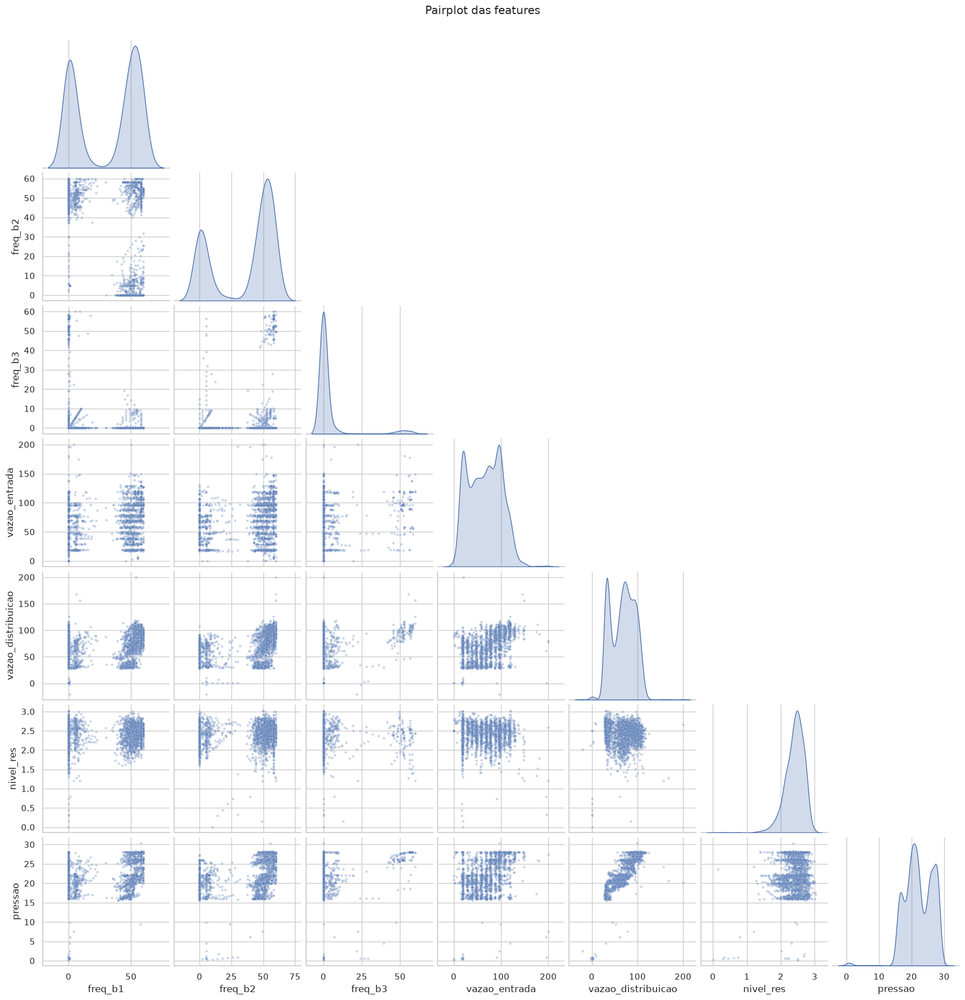

O pairplot mostra `freq_b1` vs. `freq_b2` com massa concentrada em duas faixas
claramente anticorrelacionadas (quando uma bomba liga, a outra tende a estar
desligada) — operação alternada das bombas 1 e 2, não simultânea.

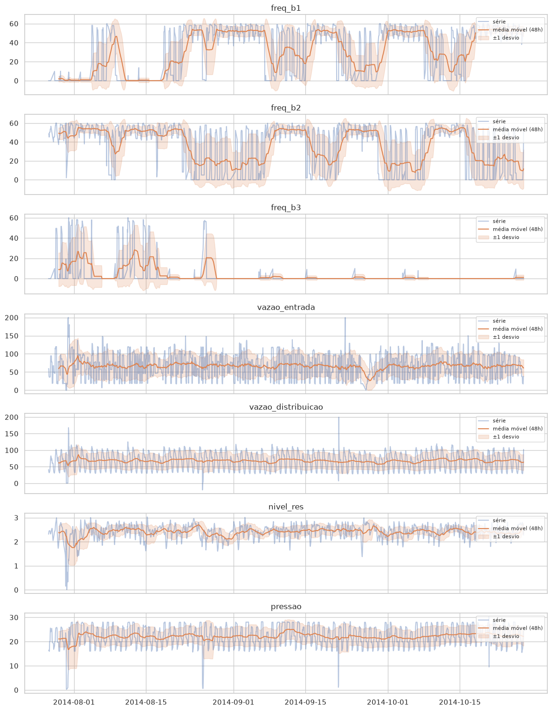

A média móvel de 48h é estável ao longo dos ~90 dias para as 3 saídas (sem deriva de
longo prazo), reforçando a conclusão de estacionariedade da seção 3. O desvio móvel
de `vazao_distribuicao` e `pressao` tem alguns picos localizados — provavelmente as
mesmas janelas de falha de sensor já catalogadas (25 amostras problemáticas) em
`1_analise-dados-reservatorio.md`.

## 2. Tendência e decomposição

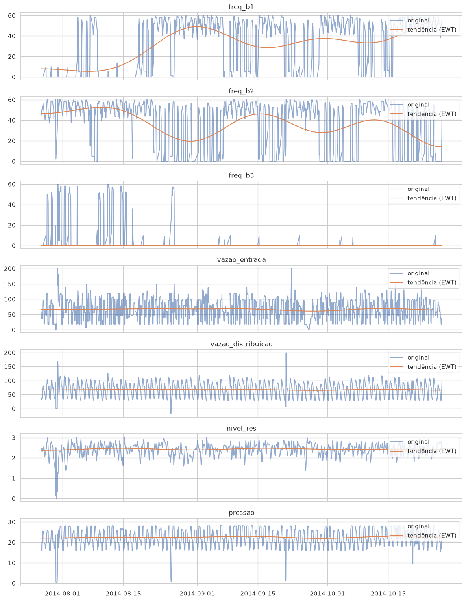

A tendência extraída pelo `TimeSeriesPreprocessor` (banda 0 da EWT, via
`get_trend_component()`) segue a envoltória de baixa frequência de cada feature sem
remover o ciclo diário — ela captura variações de escala de dias, não de horas.

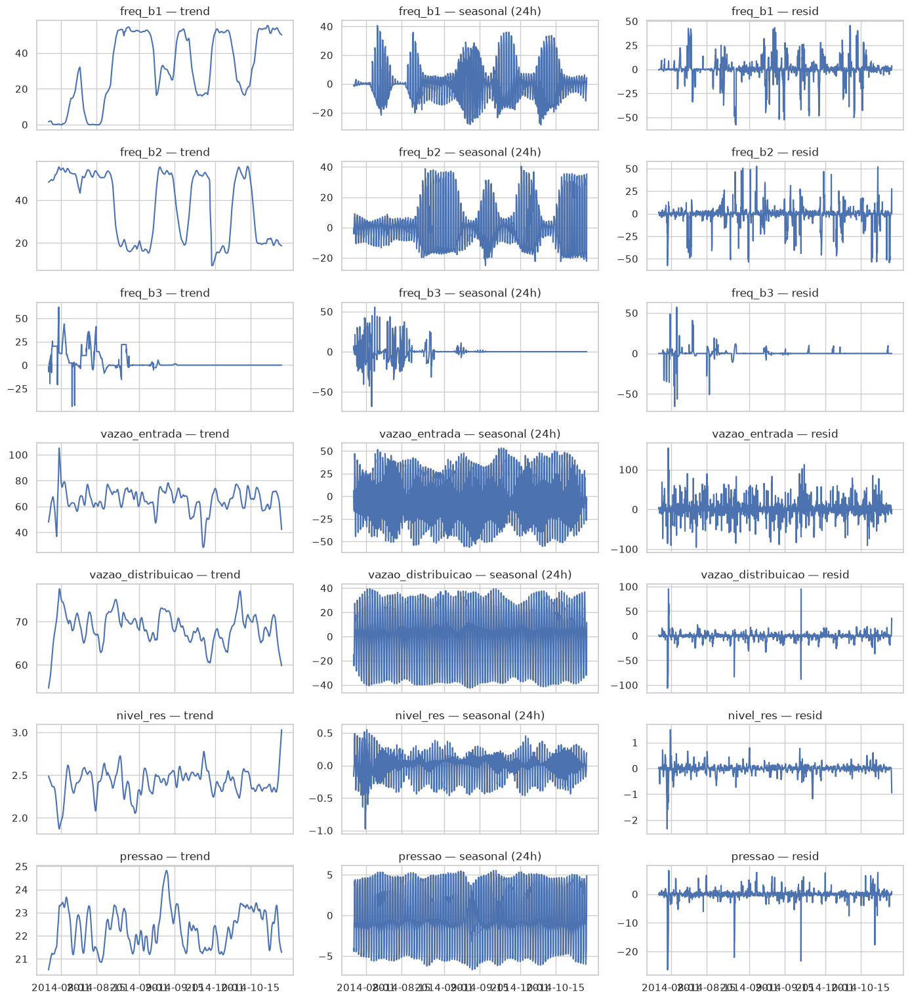

A STL (período fixo de 24h) separa de forma mais agressiva: a coluna "seasonal" isola
um ciclo diário de amplitude razoavelmente estável ao longo dos 90 dias para as 3
saídas e para `freq_b1`/`freq_b2`, e a coluna "resid" fica com ruído de alta
frequência mais os eventos de falha de sensor (picos isolados visíveis no resíduo de
`nivel_res` e `pressao`). As duas decomposições concordam na forma de baixa
frequência; a EWT é mais suave/conservadora, a STL mais específica ao ciclo de 24h.

## 3. Estacionariedade (ADF)

| Feature | ADF p-valor (original) | ADF p-valor (detrended/EWT) |
|---|---|---|
| freq_b1 | 4.2e-3 | 1.0e-5 |
| freq_b2 | 1.9e-2 | 4.5e-4 |
| freq_b3 | 2.4e-7 | 2.4e-7 |
| vazao_entrada | 5.0e-12 | 1.3e-13 |
| vazao_distribuicao | 7.7e-13 | 1.0e-13 |
| nivel_res | 2.1e-11 | 1.5e-12 |
| pressao | 3.4e-10 | 1.9e-12 |

**Todas as 7 features já são estacionárias na série original** (p < 0.05, teste de
Dickey-Fuller aumentado), e ficam ainda mais estacionárias após o detrend EWT. Isso é
coerente com a série cobrir só ~3 meses sem tendência de longo prazo visível (seção 1)
— não há necessidade de diferenciar antes de ajustar um modelo linear/ARX.

## 4. Autocorrelação (ACF/PACF)

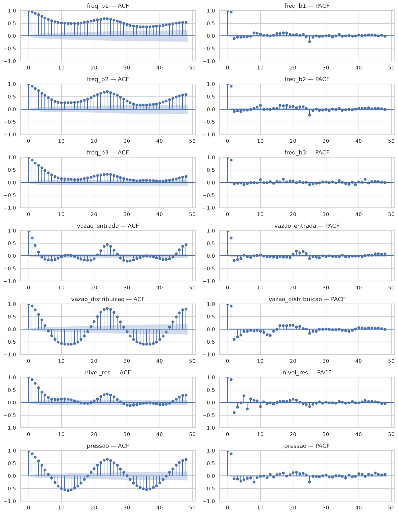

As 3 saídas e `vazao_entrada` têm ACF com decaimento lento e oscilação de período
~24 (ciclo diário de operação da estação), confirmando a leitura do domínio da
frequência (seção 6). As PACFs de `nivel_res` e `pressao` cortam de forma mais
abrupta em lag 1–2, sugerindo que um AR de ordem baixa já captura boa parte da
dinâmica linear — o que bate com os resultados de ARX da seção 7. `freq_b1`/`freq_b2`
têm PACF com picos isolados em múltiplos lags, reflexo do padrão liga/desliga
(sinal quase binário, não uma dinâmica AR suave).

## 5. Causalidade de Granger (séries detrended, lag até 12h)

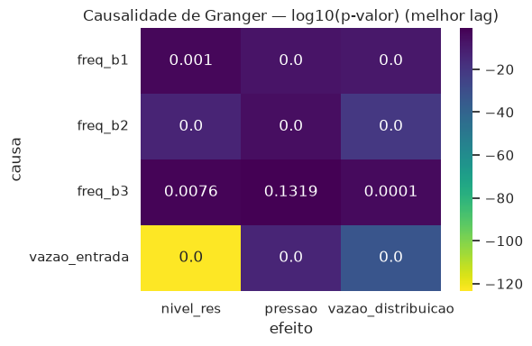

| Causa → Efeito | Melhor lag | p-valor |
|---|---|---|
| vazao_entrada → nivel_res | 1 | 5.0e-124 |
| vazao_entrada → vazao_distribuicao | 8 | 6.8e-34 |
| freq_b2 → vazao_distribuicao | 8 | 1.4e-21 |
| vazao_entrada → pressao | 9 | 3.5e-14 |
| freq_b2 → nivel_res | 12 | 8.0e-14 |
| freq_b1 → vazao_distribuicao | 9 | 1.5e-9 |
| freq_b1 → pressao | 2 | 6.2e-8 |
| freq_b3 → nivel_res | 4 | 7.6e-3 |
| freq_b3 → pressao | 1 | 0.13 (não significativo) |

`vazao_entrada` é, de forma destacada, a causa de Granger mais forte sobre as três
saídas — e sobre `nivel_res` especificamente, no lag mínimo (1h), o que é exatamente o
comportamento esperado de um balanço de massa (`A·dy2/dt = u4 − y1`, já identificado em
`1_analise-dados-reservatorio.md`). `freq_b3` (bomba que quase não opera) é a entrada
mais fraca, não-significativa sobre `pressao` — coerente com ela contribuir pouco para
o sistema na prática.

## 6. Cointegração (Engle-Granger + Johansen)

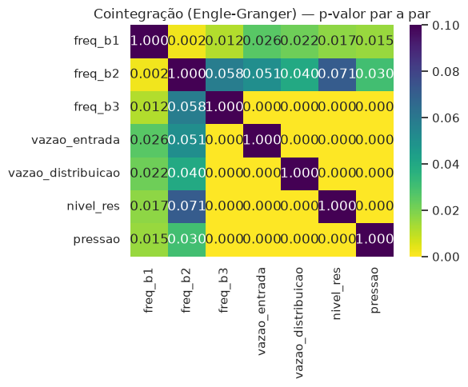

Pares cointegrados mais fortes (Engle-Granger, p < 1e-10):

| Par | p-valor |
|---|---|
| vazao_entrada / vazao_distribuicao | 7.6e-14 |
| vazao_entrada / pressao | 3.1e-13 |
| vazao_distribuicao / nivel_res | 3.6e-12 |
| vazao_entrada / nivel_res | 2.2e-11 |
| nivel_res / pressao | 3.4e-10 |

As 4 variáveis do "núcleo físico" do reservatório (`vazao_entrada`,
`vazao_distribuicao`, `nivel_res`, `pressao`) estão todas cointegradas entre si — não
divergem no longo prazo, consistente com serem partes do mesmo balanço físico. Pares
envolvendo `freq_b1`/`freq_b2` também aparecem cointegrados com p < 0.05, mas com
p-valores 2–4 ordens de magnitude maiores (menos robustos) que o núcleo físico.

Teste de Johansen (traço, conjunto completo de 7 variáveis):

| Autovalor (ordem) | Estatística de traço | Crítico 90% | Crítico 95% | Crítico 99% |
|---|---|---|---|---|
| 1 | 2515.3 | 120.4 | 125.6 | 136.0 |
| 2 | 1405.8 | 91.1 | 95.8 | 105.0 |
| 3 | 981.0 | 65.8 | 69.8 | 77.8 |
| 4 | 619.3 | 44.5 | 47.9 | 54.7 |
| 5 | 391.0 | 27.1 | 29.8 | 35.5 |
| 6 | 196.2 | 13.4 | 15.5 | 19.9 |
| 7 | 49.5 | 2.7 | 3.8 | 6.6 |

A estatística de traço excede o valor crítico a 99% em **todos** os 7 autovalores —
**rank de cointegração completo** (toda combinação linear testada rejeita a hipótese
de raiz unitária conjunta). Isso é esperado num sistema de poucas variáveis
fisicamente acopladas num reservatório fechado, e reforça que nenhuma das 7 features
"passeia livremente" no longo prazo em relação às outras.

## 7. Domínio da frequência

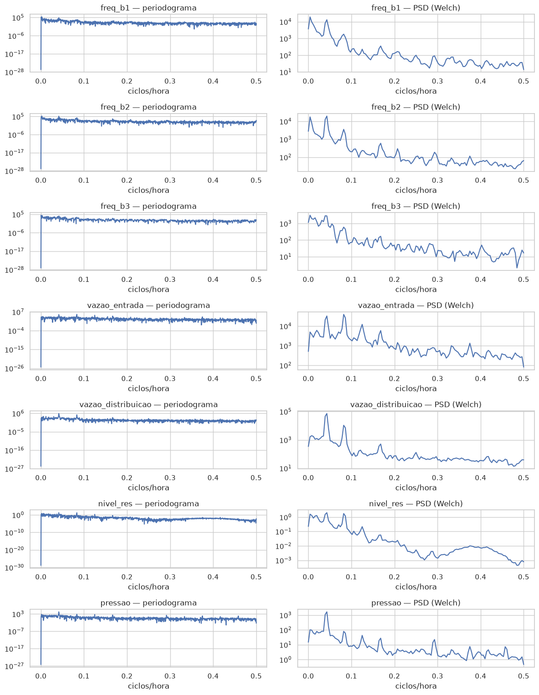

PSD (Welch) mostra, em todas as 7 features, um pico dominante em **período ≈ 23–26h**
(ciclo diário de operação da estação de bombeamento) e, nas 3 entradas de frequência
de bomba, picos secundários em ~128h e ~256h (ritmo de múltiplos dias de operação das
bombas, possivelmente ligado a manutenção/troca de regime, não a um padrão semanal
propriamente — a janela de 90 dias não cobre ciclos suficientes para distinguir os
dois). Nas vazões e no nível há também energia relevante em ~11–12h (segundo harmônico
do ciclo diário).

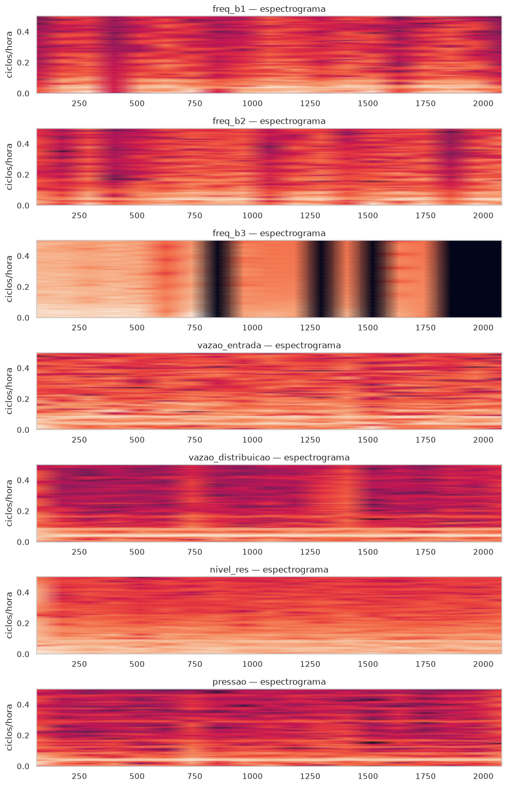

O espectrograma mostra que a energia no ciclo diário (~24h) é persistente ao longo de
toda a janela de 90 dias para as 3 saídas — não é um efeito transiente de um único
trecho da série. `freq_b1`/`freq_b2` mostram faixas de energia mais intermitentes,
coerente com períodos em que uma bomba específica fica fora de operação.

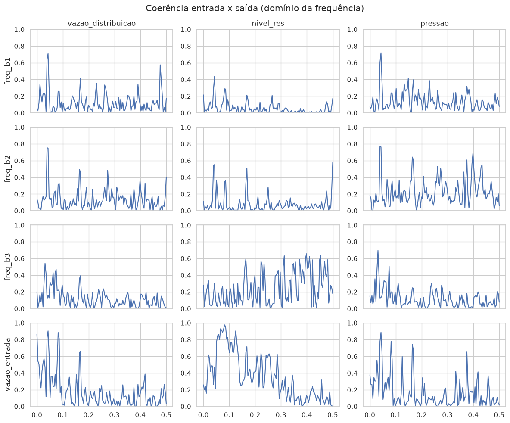

Coerência entrada→saída (pico na faixa 2–32h):

| Entrada → Saída | Coerência máx. | Período do pico |
|---|---|---|
| vazao_entrada → nivel_res | **0.98** | 12.2h |
| vazao_entrada → vazao_distribuicao | 0.90 | 23.3h |
| vazao_entrada → pressao | 0.89 | 23.3h |
| freq_b2 → pressao | 0.77 | 25.6h |
| freq_b2 → vazao_distribuicao | 0.75 | 25.6h |
| freq_b1 → pressao | 0.72 | 23.3h |
| freq_b3 → nivel_res | 0.66 | 2.5h |

`vazao_entrada` tem coerência quase perfeita (0.98) com `nivel_res` no harmônico de
12h — a relação entrada↔nível é quase linear e invariante no tempo nessa banda, o
equivalente em frequência à causalidade de Granger forte da seção 5. As bombas
(`freq_b1`/`freq_b2`) influenciam mais a pressão e a vazão de distribuição do que o
nível, o que é plausível fisicamente (perda de carga dependente de vazão, não de
nível — confirmado também em `1_analise-dados-reservatorio.md`, seção 4, onde
`pressao ~ vazao` domina sobre `pressao ~ nivel`). `freq_b3 → nivel_res` tem coerência
razoável (0.66) mas num período muito curto (2.5h) — provavelmente ruído de alta
frequência coincidente, não uma relação física robusta, dado que `freq_b3` quase não
opera.

## 8. DTW e clustering de séries temporais

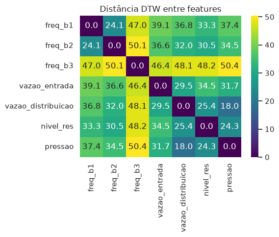

Distância DTW (séries padronizadas) entre as 7 features — menores distâncias:

| Par | Distância DTW |
|---|---|
| freq_b1 / freq_b2 | 24.1 |
| vazao_distribuicao / pressao | 18.0 |
| nivel_res / pressao | 24.3 |
| nivel_res / vazao_distribuicao | 25.4 |

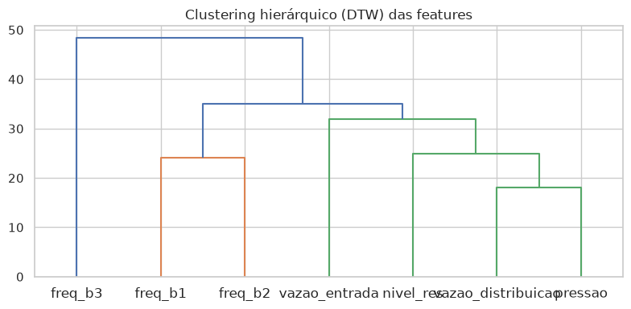

O clustering hierárquico sobre essa matriz separa dois grupos nítidos: **(freq_b1,
freq_b2)** — as duas bombas que efetivamente operam — e **(vazao_distribuicao,
nivel_res, pressao)** — as 3 saídas físicas do reservatório, com `vazao_distribuicao`
e `pressao` como o par mais próximo (DTW 18.0, também a maior correlação linear do
dataset, seção 1). `freq_b3` (bomba inativa na maior parte do tempo) e
`vazao_entrada` ficam isoladas dos dois clusters, como esperado — `freq_b3` por ser
quase constante/zero e `vazao_entrada` por ser a variável de forçante externa, não uma
saída do sistema.

## 9. Shapelets (padrões recorrentes)

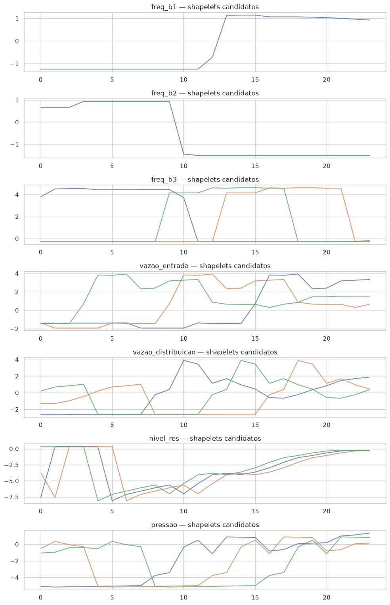

A extração simples de shapelets (janelas de 24h de maior variância, mutuamente
distintas) recupera, para as 3 saídas, blocos de subida/descida de amplitude
comparável ao ciclo diário identificado na seção 7 — nenhum padrão de alta frequência
"escondido" além do ciclo de ~24h já visível na PSD. Para as frequências das bombas
(`freq_b1`/`freq_b2`), os shapelets capturam os blocos de liga/desliga (chaveamento
entre ~0 e a frequência nominal), reforçando a leitura binária dessas variáveis já
vista no pairplot (seção 1).

## 10. Identificação de sistemas (ARX, ordem 2)

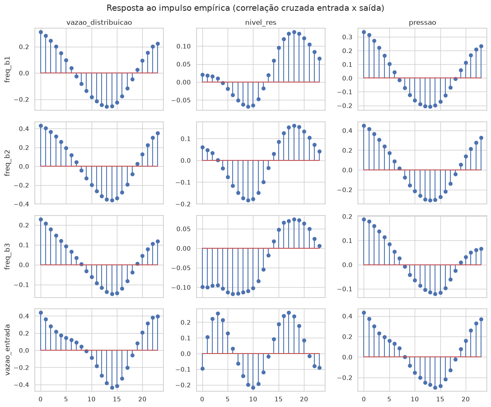

A resposta ao impulso empírica (correlação cruzada normalizada, 24 lags) tem pico
pronunciado em lag pequeno (1–2h) para `vazao_entrada → nivel_res`, e picos mais
espalhados/fracos para os pares com `vazao_distribuicao` — o mesmo padrão de
"nível responde rápido e forte, vazão de distribuição responde devagar e fraco" das
seções 5–7.

RMSE (predição 1 passo) por par entrada→saída e estabilidade dos polos, modelo
`y[k] = a1·y[k-1] + a2·y[k-2] + b0·u[k] + b1·u[k-1]` ajustado por mínimos quadrados:

| Entrada → Saída | RMSE | Polos | Estável |
|---|---|---|---|
| vazao_entrada → nivel_res | **0.104** | 0.942, 0.234 | sim |
| freq_b2 → nivel_res | 0.116 | 0.994, 0.337 | sim |
| freq_b1 → nivel_res | 0.117 | 0.994, 0.336 | sim |
| freq_b3 → nivel_res | 0.117 | 0.997, 0.333 | sim |
| freq_b2 → pressao | 1.863 | 0.982, 0.028 | sim |
| freq_b1 → pressao | 1.971 | 0.987, 0.033 | sim |
| freq_b3 → pressao | 2.056 | 0.994, 0.046 | sim |
| vazao_entrada → pressao | 2.068 | 0.983, 0.023 | sim |
| freq_b2 → vazao_distribuicao | 9.241 | 0.938, 0.326 | sim |
| freq_b1 → vazao_distribuicao | 9.342 | 0.956, 0.333 | sim |
| freq_b3 → vazao_distribuicao | 9.633 | 0.979, 0.350 | sim |
| vazao_entrada → vazao_distribuicao | 9.734 | 0.938, 0.384 | sim |

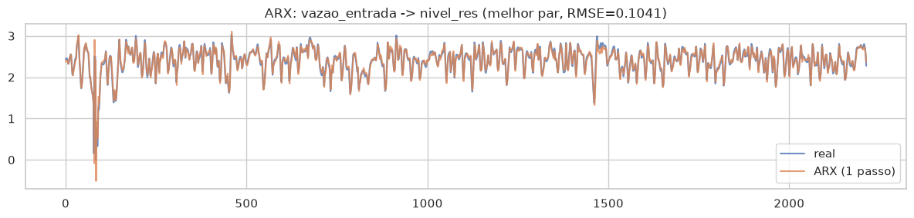

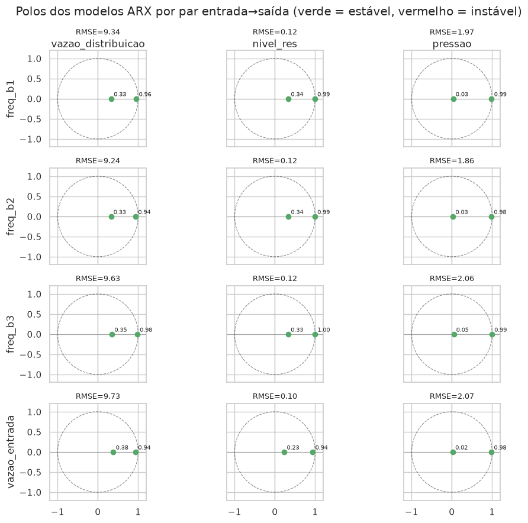

Todos os 12 modelos ARX ajustados (4 entradas × 3 saídas) ficam **estáveis** (polos
dentro do círculo unitário) e o polo dominante fica sempre entre 0.94–0.997 — dinâmica
lenta, coerente com um reservatório de resposta amortecida (constante de tempo de
dezenas de horas, não minutos). `nivel_res` é, de longe, a saída mais previsível por um
ARX simples (RMSE ~10× menor que para `vazao_distribuicao`), o que bate com a leitura
da seção 7 (coerência quase perfeita com `vazao_entrada`) e com a resposta ao impulso
concentrada em lags curtos.

## 11. O que isso muda no desenho do TCC

1. **`nivel_res` é a saída "fácil"**: estacionária, coerência quase 1 com
   `vazao_entrada`, ARX de ordem 2 já dá RMSE baixo e resposta ao impulso concentrada
   em 1–2h. Qualquer modelo mais complexo (GNN, etc.) precisa justificar o ganho
   sobre esse baseline simples, não só sobre persistência (ver também
   `1_analise-dados-reservatorio.md`, seção 3).
2. **`vazao_distribuicao` é a saída "difícil"**: menor coerência com as entradas
   medidas, maior RMSE em ARX, resposta ao impulso mais espalhada/fraca — sugere que
   falta uma variável explicativa (igual ao "fluxo não instrumentado" já suspeitado em
   `1_analise-dados-reservatorio.md`, seção 5) ou que a relação é mais não-linear/
   variante no tempo do que um ARX linear capta.
3. **Cointegração completa (rank 7) entre as 7 variáveis**, com o núcleo físico
   (`vazao_entrada`, `vazao_distribuicao`, `nivel_res`, `pressao`) sendo o mais robusto
   — evidência adicional, independente do balanço de massa já derivado, de que essas
   4 variáveis pertencem ao mesmo subsistema físico. Reforça a escolha de modelar o
   nível via diferença (`Δy2`) em vez de valor absoluto.
4. **Nenhuma periodicidade além do ciclo diário** aparece de forma robusta (PSD,
   espectrograma, coerência e shapelets concordam) — não há evidência de um padrão
   semanal real, só múltiplos do ciclo diário dentro da janela de ~90 dias. Features
   de calendário além de hora-do-dia (ex. dia-da-semana) provavelmente agregam pouco.
5. **Dinâmica lenta (polos ARX ~0.94–0.997)**: horizontes de previsão curtos (poucas
   horas) deveriam ser bem mais fáceis que horizontes longos — vale reportar RMSE por
   horizonte, não só agregado.
6. **`freq_b1`/`freq_b2` operam de forma alternada e quase binária** (pairplot,
   shapelets) — um encoder que trate essas entradas como contínuas/suaves (ex. um
   MLP simples) pode ser subótimo frente a algo que modele explicitamente o estado
   discreto liga/desliga.
